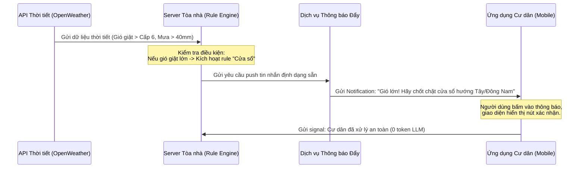
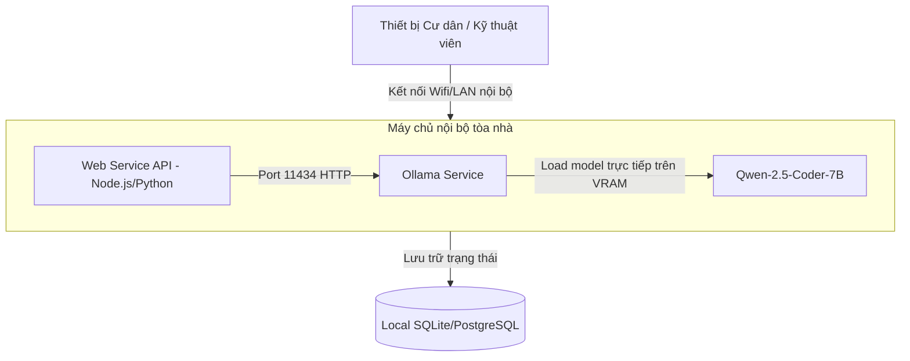

# BÀI THU HOẠCH CHI TIẾT DAY 17: KIỂM CHỨNG GIẢ THUYẾT (HYPOTHESIS TESTING)

## Thông tin học viên

| Trường | Điền |
| :--- | :--- |
| **Mã học viên** | HV00760 |
| **Họ tên** | Nguyễn Đông Anh |
| **Dự án đang làm** | Chatbot tích hợp dự báo thời tiết & dự đoán hỏng hóc thiết bị căn hộ |
| **Vai trò của bạn trong dự án** | AI Engineer / Product Owner |

---

## 1. JTBD Checkpoint & Khung phân tích chuyên sâu

### JTBD Checkpoint (Jobs-to-be-done)
* **Hoàn cảnh (When)**: Khi thời tiết diễn biến cực đoan (như bão lớn, mưa lớn kéo dài, nắng nóng đỉnh điểm) ảnh hưởng trực tiếp đến căn hộ cao tầng Vinhomes, hoặc khi cư dân phát hiện ra các sự cố hỏng hóc kỹ thuật trong đợt bàn giao/vận hành căn hộ.
* **Hành động (I want to)**: 
  * Người dùng muốn hỏi đáp nhanh với trợ lý ảo thông minh để biết cách xử lý tức thời các vấn đề kỹ thuật.
  * Người dùng muốn nhận cảnh báo thời tiết chủ động cùng các dự báo về nguy cơ hỏng hóc vật lý tiềm ẩn trong căn hộ dựa trên vị trí và hướng nhà (Ví dụ: hướng gió tạt Đông Nam, tầng cao).
* **Kết quả mong đợi (So that)**: 
  * Chủ động bảo vệ tài sản, ngăn chặn rò rỉ nước, ngập úng hoặc chập điện trước khi sự cố xảy ra.
  * Giảm thiểu ít nhất 30% chi phí sửa chữa khắc phục sự cố sau bão.
  * Tiết kiệm thời gian báo cáo và theo dõi xử lý sự cố cho Ban quản lý (BQL) tòa nhà.
* **Social/Emotional Job**: Cư dân cảm thấy an tâm, được chăm sóc chu đáo, hiện đại; BQL chứng tỏ sự chuyên nghiệp, số hóa và chủ động bảo vệ quyền lợi cư dân.

---

## 2. Hypothesis Card (Thẻ giả thuyết kiểm chứng)

* **Giả thuyết cốt lõi**: Việc tích hợp trợ lý AI thông minh có khả năng dự báo thời tiết kết hợp phân tích nguy cơ hỏng hóc vật lý sẽ giúp giảm thiểu 30% tỷ lệ hỏng hóc thiết bị do thiên tai tại các căn hộ Vinhomes, đồng thời tăng mức độ hài lòng của cư dân lên trên 90%.
* **Để kiểm chứng điều này, chúng tôi cần kiểm tra các giả thuyết phụ về chi phí**:
  1. *Giả thuyết phụ A*: Chúng ta có thể thay thế Gemini API đắt đỏ bằng một API mã nguồn mở rẻ hơn (DeepSeek-V3/R1) mà chất lượng suy luận kỹ thuật vẫn tương đương.
  2. *Giả thuyết phụ B*: Việc chỉ gửi tin nhắn cảnh báo thời tiết tĩnh kèm khuyến nghị định sẵn (không cần LLM động) là đủ giải quyết 80% nhu cầu thực tế của cư dân.
  3. *Giả thuyết phụ C*: Có thể deploy mô hình LLM chạy cục bộ (Local Model) trên máy chủ hạ tầng của Vinhomes để tiết kiệm hoàn toàn phí gọi API Cloud và bảo vệ dữ liệu.

---

## 3. Current Approach Snapshot (Cách tiếp cận hiện tại)

* **Thiết kế kiến trúc hiện tại**:
  * **Frontend**: Giao diện React/Vite tích hợp khung chat trực quan.
  * **AI Service**: Gọi trực tiếp Gemini 1.5 Flash (hoặc Gemini 1.5 Pro cho các case khó) của Google Cloud. Mỗi khi có dự báo thời tiết mới từ API hoặc khi người dùng upload ảnh lỗi ban công, hệ thống gửi toàn bộ ngữ cảnh (System Prompt + Lịch sử Chat + Ảnh + Dữ liệu thời tiết hiện tại) cho Gemini để phân tích mối tương quan và dự báo rủi ro hỏng hóc.
* **Vấn đề & Rào cản chi phí**:
  * **Phí API cao**: Với 10.000 cư dân hoạt động hàng ngày, lượng tokens tiêu thụ cực lớn (đặc biệt khi đính kèm ảnh Vision chất lượng cao). Chi phí có thể lên tới hàng ngàn USD/tháng.
  * **Phụ thuộc Cloud**: Nếu mất kết nối internet toàn cầu hoặc Cloud API bị nghẽn (rate limit), chatbot sẽ ngừng hoạt động, ảnh hưởng trực tiếp đến công tác cứu hộ sự cố trong bão lũ.

---

## 4. Chi tiết 3 Phương án Test Rẻ hơn

### Cách test A: Chuyển đổi sang API rẻ hơn (DeepSeek)

| Câu hỏi | Điền |
| :--- | :--- |
| `Tên hướng test A` | Sử dụng API DeepSeek-V3 và DeepSeek-R1 để thay thế Gemini API |
| `Loại artifact` | Bảng so sánh chi phí & Kịch bản Test mẫu so sánh chất lượng (Benchmark Dataset & Prompt QA) |
| `Người dùng sẽ thấy gì?` | Trải nghiệm giao diện chatbot hoàn toàn giống như cũ. Thời gian phản hồi có thể thay đổi nhẹ nhưng nội dung tư vấn kỹ thuật cực kỳ chi tiết, mạch lạc. |
| `Phía sau bạn sẽ làm gì?` | Thiết lập một script Python chạy test offline. Gửi cùng 30 câu hỏi về thời tiết & hỏng hóc kỹ thuật xây dựng cho cả Gemini API và DeepSeek API để đánh giá chéo chất lượng câu trả lời. |
| `Vì sao rẻ hơn?` | DeepSeek API có chi phí cực kỳ rẻ (chỉ bằng khoảng 10-15% chi phí của Gemini Pro). Ta kiểm chứng chất lượng câu trả lời thông qua script trước khi sửa code frontend, giúp tiết kiệm hàng chục giờ dev. |
| `Nó giúp học được gì?` | Đánh giá được mức độ hiểu sâu về kỹ thuật xây dựng dân dụng và khả năng suy luận logic của DeepSeek so với Gemini. |
| `Nó chưa giúp học được gì?` | Chưa kiểm tra được khả năng nhận diện hình ảnh hỏng hóc thực tế (DeepSeek-V3 không có Vision mạnh như Gemini). |
| `Artifact A nằm ở đâu?` | [Xem Artifact A bên dưới](#artifact-a-chi-tiet-doi-chieu-chi-phi-va-chat-luong-gemini-vs-deepseek) |

---

### Cách test B: Giới hạn phạm vi (Chỉ gửi thông báo thời tiết tĩnh)

| Câu hỏi | Điền |
| :--- | :--- |
| `Tên hướng test B` | Tối giản hóa thành hệ thống Weather-only Alerts dựa trên Rule-based |
| `Loại artifact` | Sơ đồ luồng Before/After & Storyboard mô phỏng trải nghiệm người dùng |
| `Người dùng sẽ thấy gì?` | Nhận được các thông báo đẩy trên điện thoại khi trời sắp mưa bão với nội dung mẫu cố định (Ví dụ: *"Dự báo mưa bão lớn, quý cư dân hướng gió tạt vui lòng chốt chặt cửa"*). Không có ô chat tự do với AI. |
| `Phía sau bạn sẽ làm gì?` | Kết nối trực tiếp hệ thống với một API thời tiết miễn phí. Tạo bộ lọc điều kiện (ví dụ: mưa > 30mm hoặc gió > cấp 6) để tự động bắn tin nhắn mẫu cố định (Template) đến nhóm cư dân liên quan. |
| `Vì sao rẻ hơn?` | Chi phí gọi LLM giảm về 0 USD. Không cần thiết kế prompt, không cần quản lý ngữ cảnh hội thoại phức tạp. |
| `Nó giúp học được gì?` | Kiểm chứng xem giá trị cốt lõi nhất mà cư dân cần là tin nhắn cảnh báo để hành động (Actionable Alert) hay là việc ngồi chat hỏi đáp chuyên sâu với AI. |
| `Nó chưa giúp học được gì?` | Sự hài lòng của cư dân khi họ gặp các tình huống hỏng hóc cụ thể, phức tạp nằm ngoài kịch bản mẫu tĩnh. |
| `Artifact B nằm ở đâu?` | [Xem Artifact B bên dưới](#artifact-b-storyboard-and-before-after-user-flow-weather-alerts-only) |

---

### Cách test C: Sử dụng Local LLM offline (Ollama)

| Câu hỏi | Điền |
| :--- | :--- |
| `Tên hướng test C` | Triển khai mô hình Local LLM (Qwen-2.5-Coder / Llama-3) chạy offline qua Ollama |
| `Loại artifact` | Sơ đồ kiến trúc phần cứng cục bộ & Script chạy thử nghiệm đo hiệu năng (Local Setup Guide) |
| `Người dùng sẽ thấy gì?` | Người dùng trò chuyện bình thường với chatbot, hệ thống hoạt động tốt kể cả khi mất kết nối mạng Internet quốc tế. |
| `Phía sau bạn sẽ làm gì?` | Cài đặt Ollama lên một máy tính nội bộ có sẵn card đồ họa GPU (ví dụ: RTX 3060/4060). Load model Qwen-2.5-Coder-7B và chạy thử nghiệm đo tốc độ sinh chữ (tokens/second) cùng lượng RAM/VRAM chiếm dụng. |
| `Vì sao rẻ hơn?` | Chi phí sử dụng API hàng tháng hoàn toàn bằng 0. Tận dụng hạ tầng máy chủ sẵn có của Ban quản lý tòa nhà Vinhomes. |
| `Nó giúp học được gì?` | Đánh giá được tốc độ phản hồi thực tế (latency) và khả năng xử lý offline hoàn toàn của hệ thống khi bão đổ bộ làm đứt cáp quang/mất internet. |
| `Nó chưa giúp học được gì?` | Khả năng tự động cập nhật tri thức mới (LLM local không tự cập nhật dữ liệu nếu không làm thêm hệ thống RAG). |
| `Artifact C nằm ở đâu?` | [Xem Artifact C bên dưới](#artifact-c-local-ollama-setup-architecture-and-benchmark-guide) |

---

## 5. Chi tiết các Artifact kiểm chứng

### ARTIFACT A: Chi tiết đối chiếu chi phí và chất lượng (Gemini vs DeepSeek)

#### 1. Bảng so sánh chi phí API chi tiết (Đơn vị: USD / 1M Tokens)

| Chỉ số so sánh | Gemini 1.5 Flash | Gemini 1.5 Pro | DeepSeek-V3 | DeepSeek-R1 (Suy luận) |
| :--- | :--- | :--- | :--- | :--- |
| **Giá Input Token** | $0.075 | $1.25 | $0.14 | $0.55 |
| **Giá Output Token** | $0.30 | $5.00 | $0.28 | $2.19 |
| **Khả năng xử lý ảnh**| Rất tốt (Vision nhạy) | Xuất sắc | Không hỗ trợ trực tiếp | Không (phải qua model Vision phụ) |
| **Độ thông minh/Suy luận**| Khá (Đôi khi hời hợt) | Xuất sắc | Rất tốt | Xuất sắc (vượt trội về toán/code/logic) |

#### 2. Kịch bản đối chiếu chất lượng phản hồi thực tế (Prompt Test Case)
* **Prompt gửi đi**: *"Tôi ở căn hộ tầng 32 hướng Tây Bắc tòa S2.12. Thời tiết dự báo chiều nay nắng nóng đỉnh điểm 41 độ C kèm chỉ số UV cực cao. Hệ thống kính hộp Low-E và điều hòa cục bộ nhà tôi có nguy cơ gì, tôi cần làm gì để phòng tránh hỏng hóc?"*

* **Kết quả từ Gemini 1.5 Flash (Phản hồi nhanh nhưng chung chung)**:
  > *"Thời tiết nắng nóng 41 độ C có thể làm tăng nhiệt độ trong nhà qua kính. Bạn nên kéo rèm cửa, bật điều hòa ở mức 26 độ để tiết kiệm điện, và tránh đi ra ngoài trời nắng."* (Đánh giá: 6/10 - Không phân tích sâu đặc thù kỹ thuật kính Low-E hay hệ thống điều hòa căn hộ cao tầng).

* **Kết quả từ DeepSeek-R1 (Phân tích suy luận sâu sắc)**:
  > *`<thought> Căn hộ tầng 32 hướng Tây Bắc chịu bức xạ trực tiếp vào buổi chiều. Kính Low-E có lớp phủ cản nhiệt nhưng nếu nhiệt độ chênh lệch quá lớn giữa mặt trong và mặt ngoài kính hộp có thể gây nứt vỡ do ứng suất nhiệt (thermal stress). Điều hòa cục bộ ở căn hộ tầng cao dễ bị giải nhiệt kém do gió nóng quẩn ở logia. </thought>`*
  > *`Phân tích nguy cơ kỹ thuật cho căn hộ tầng 32 hướng Tây Bắc:`*
  > *`1. Nguy cơ nứt kính do ứng suất nhiệt: Kính Low-E hấp thụ nhiệt tốt, nhưng nếu bên trong bật điều hòa quá lạnh sát vách kính, chênh lệch nhiệt độ lớn dễ làm nứt kính.`*
  > *`2. Điều hòa ngắt block (quá tải): Hướng Tây Bắc nắng chiếu trực diện logia lắp dàn nóng. Dàn nóng không thoát được nhiệt sẽ tự ngắt bảo vệ.`*
  > *`Khuyến nghị hành động chủ động:`*
  > *`- Không dán decal tối màu lên kính Low-E vì sẽ tăng khả năng hấp thụ nhiệt gây nứt kính.`*
  > *`- Để gió cục nóng điều hòa thoát thẳng ra ngoài logia (lắp thêm mặt nạ chuyển hướng gió nếu cần).`*
  > *`- Bật điều hòa từ 26 độ C trở lên, kết hợp quạt, tránh đặt luồng gió lạnh thổi thẳng vào mặt kính cường lực.`* (Đánh giá: 9.5/10 - Rất sâu về mặt vật lý và kỹ thuật xây dựng).

---

### ARTIFACT B: Storyboard and Before-After User Flow (Weather Alerts-only)

Hệ thống chuyển đổi từ luồng Chatbot AI chủ động phức tạp sang quy trình thông báo đẩy tự động dựa trên quy tắc (Rule-based Alerts).



**So sánh luồng xử lý trước và sau:**

* **Trước (Current Cloud API Flow)**:
  * Người dùng chat: *"Trời mưa to quá, tôi nên làm gì với cửa kính ban công?"* $\rightarrow$ Server gửi prompt lên Gemini $\rightarrow$ Gemini sinh câu trả lời $\rightarrow$ Trả về ứng dụng. (Chi phí tích lũy cao theo lượt chat).
* **Sau (Tối giản tĩnh)**:
  * Server tự động phát hiện mưa to $\rightarrow$ Bắn thông báo mẫu cố định tới toàn bộ cư dân. Người dùng chỉ cần làm theo và tích chọn *"Đã đóng cửa"* để báo cáo trạng thái an toàn về BQL. Không mất chi phí AI suy luận.

---

### ARTIFACT C: Local Ollama Setup Architecture and Benchmark Guide

Thiết lập mô hình ngôn ngữ lớn chạy hoàn toàn cục bộ để bảo mật và hoạt động offline trong điều kiện thiên tai mất mạng Internet.



#### Các bước triển khai thử nghiệm (Developer Benchmark Script):

1. **Cài đặt Ollama lên máy chủ cục bộ (Ubuntu/macOS)**:
   ```bash
   curl -fsSL https://ollama.com/install.sh | sh
   ```
2. **Khởi chạy mô hình được tối ưu hóa cho suy luận kỹ thuật nhẹ (Qwen 2.5 Coder 7B)**:
   ```bash
   ollama run qwen2.5-coder:7b
   ```
3. **Chạy script Node.js benchmark hiệu năng sinh text nội bộ (`benchmark.js`)**:
   ```javascript
   const start = Date.now();
   fetch('http://localhost:11434/api/generate', {
     method: 'POST',
     headers: { 'Content-Type': 'application/json' },
     body: JSON.stringify({
       model: 'qwen2.5-coder:7b',
       prompt: 'Dự báo bão lớn đổ bộ, cần kiểm tra gấp những hạng mục cơ điện (M&E) nào của tòa nhà cao tầng?',
       stream: false
     })
   })
   .then(res => res.json())
   .then(data => {
     const duration = (Date.now() - start) / 1000;
     const tokenCount = data.eval_count;
     console.log(`[KẾT QUẢ BENCHMARK LOCAL]`);
     console.log(`- Thời gian xử lý: ${duration} giây`);
     console.log(`- Số lượng Token trả về: ${tokenCount}`);
     console.log(`- Tốc độ sinh chữ: ${(tokenCount / duration).toFixed(2)} tokens/giây`);
   });
   ```

---

## 6. Bảng so sánh 3 phương án kiểm chứng rẻ hơn

| Tiêu chí | Cách A (DeepSeek API) | Cách B (Rule-based Alerts) | Cách C (Local Ollama) |
| :--- | :--- | :--- | :--- |
| **Nhanh hơn current approach ở đâu?** | Sử dụng chung thư viện OpenAI SDK, chỉ cần đổi API Key và Base URL mất 5 phút. | Rút ngắn thời gian lập trình AI, không cần viết prompt hay quản lý ngữ cảnh động. | Không cần chờ đợi duyệt tài khoản Cloud doanh nghiệp, chạy thử được ngay trên máy trạm dev. |
| **Rẻ hơn current approach ở đâu?** | Giá API DeepSeek rẻ hơn Gemini Pro khoảng 10-15 lần cho 1 triệu tokens. | Tiết kiệm triệt để nhất (Chi phí AI bằng 0 USD). | Chi phí vận hành lâu dài bằng 0 USD (không phát sinh phí theo lượt sử dụng). |
| **Độ chân thực với hành vi người dùng** | Cực cao (95%) vì người dùng vẫn chat tự do với chatbot thông minh. | Trung bình (60%) vì người dùng bị bó hẹp trong các tin nhắn mẫu tĩnh nhận được. | Cao (90%) nếu cấu hình phần cứng đủ mạnh để tránh trễ phản hồi. |
| **Bài học lớn nhất rút ra** | Biết được mô hình ngôn ngữ giá rẻ có đủ khả năng tư vấn kỹ thuật chính xác không. | Xác định xem cư dân có thực sự cần chat hai chiều hay chỉ cần cảnh báo một chiều. | Đánh giá được năng lực đáp ứng của phần cứng nội bộ khi chạy offline hoàn toàn. |
| **Giới hạn/Rủi ro lớn nhất** | Mạng kết nối API của DeepSeek đôi khi bị quá tải cục bộ hoặc phản hồi chậm. | Cư dân có thể bỏ qua thông báo vì tin nhắn mẫu đơn điệu, thiếu tính tương tác cá nhân. | Chi phí đầu tư thiết bị phần cứng ban đầu cao hơn nếu tòa nhà chưa có máy chủ GPU. |

---

## 7. Tài liệu chuẩn bị thuyết trình (Present Prep)

* **Giải pháp đề xuất khi thuyết trình**: Chúng tôi đề xuất triển khai **Cách A (Chuyển sang dùng API DeepSeek)** để test khả năng tư vấn kỹ thuật của chatbot thông minh trước, kết hợp **Cách B (Gửi Alert tĩnh)** cho các tình huống khẩn cấp diện rộng nhằm giảm thiểu chi phí phát sinh tối đa.
* **Câu hỏi phản biện dự kiến từ hội đồng**:
  1. *Hội đồng hỏi*: *"DeepSeek không mạnh về xử lý ảnh (Vision) bằng Gemini, làm sao giải quyết bài toán cư dân chụp ảnh lỗi gửi lên?"*
     * *Trả lời*: Chúng tôi sử dụng giải pháp Hybrid: Với các lượt chat thông thường và dự báo thời tiết bằng text, chúng tôi gọi DeepSeek API. Chỉ khi cư dân upload ảnh lỗi cần phân tích hình ảnh, hệ thống mới chuyển hướng gọi Gemini 1.5 Flash. Cách này giúp tối ưu 80% chi phí chat text thông thường.
  2. *Hội đồng hỏi*: *"Nếu dùng Local Model (Cách C), chi phí phần cứng ban đầu rất lớn, làm thế nào để chứng minh tính khả thi?"*
     * *Trả lời*: Chúng tôi không đầu tư máy chủ mới ngay từ đầu. Chúng tôi tận dụng chính máy tính cấu hình văn phòng có sẵn card đồ họa của bộ phận kỹ thuật vận hành tòa nhà để chạy thử nghiệm nghiệm thu (PoC) trong 2 tuần đầu tiên trước khi quyết định mua sắm thiết bị chuyên dụng.